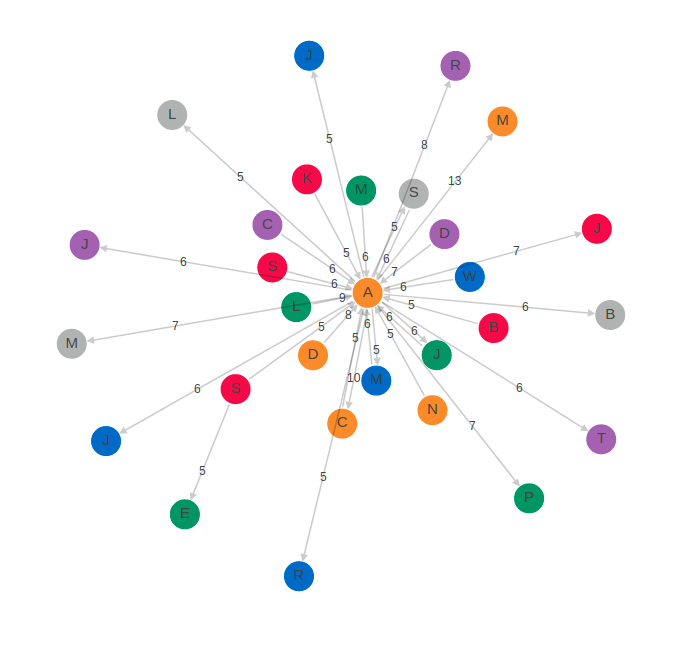

# Network Graph Visualization

This project contains my solution to the Case Study for the first round of the recruitment process for the position "Internship for Computer Science or Machine Learning Students in Advanced Analytics Network" at Roche.

## Installation

All the necessary packages can be installed using [pip](https://pip.pypa.io/en/stable/) with the following command:

```bash
pip install -r requirements.txt
```
## How to Run

To run this project use the command:
```bash
python main.py <filename>
```
`<filename>` is the name of the Excel file and must be placed in the `data` folder. 
For the given data, the following command can be used:
```bash
python main.py raan_case_study.xlsx
```


## Description

The input is given as an Excel document with the columns "source_id", "target_id", and "weights".
Each row represents a weighted directed edge from the source node to the target node.
The output consists of visualizations representing the given network. 
There are several options for choosing the visualization type. 
Both the dimension and the layout can be chosen from a dropdown menu. 
The figure is shown after clicking the submit button.

### 2D
In the 2-dimensional visualization, the weights are given on the corresponding edges.
The following four layouts can be chosen:
* Spring Layout (example below)
* Random Layout
* Bipartite Layout
* Circular Layout



### 3D
In the 3-dimensional visualization, the color of the edges represent the weights.
Additionally, by hovering over the edges, a description of the edge direction and weight is given.
The figure can be turned by clicking on the figure and moving the mouse. Zooming in and out is possible by scrolling up and down.
The following two layouts can be chosen:
* Spring Layout (example below)
* Random Layout


## Web Application
The network visualization is deployed at: https://isabel-margolis-roche.herokuapp.com/

